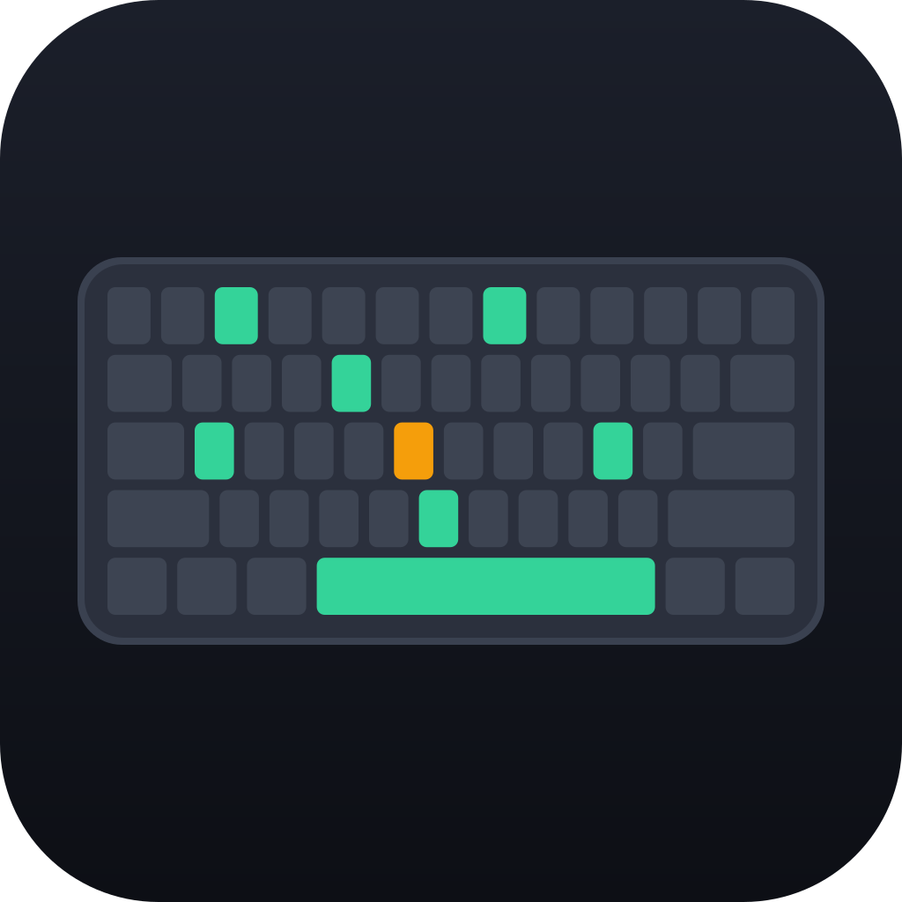
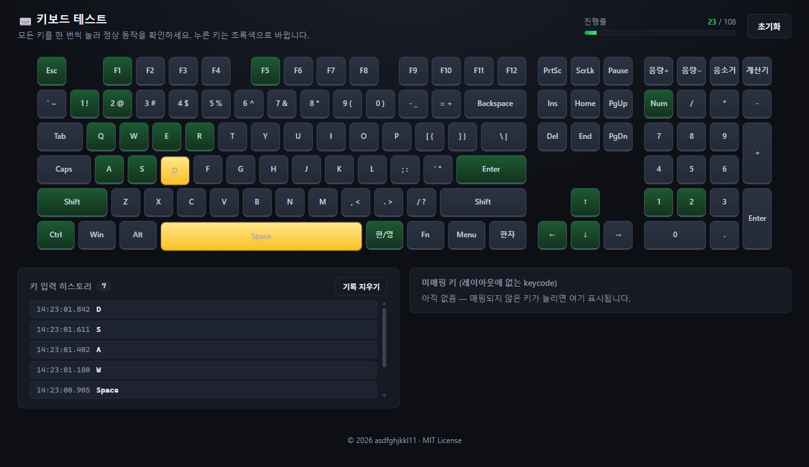

<div align="center">



# 키보드 테스트 (Keyboard Tester)

물리 키보드의 **모든 키**가 정상적으로 입력되는지 확인하는 Windows 데스크톱 앱.


</div>



---

## 기능

- 🎹 **풀사이즈 104키 + 한국어 키보드** 레이아웃을 화면에 그대로 표시
- ✅ 누른 키는 **초록색(완료)**, 누르는 중에는 **앰버색**으로 표시
- 📊 **진행률 바** — 전체 키 중 몇 개를 확인했는지 실시간 표시, 전부 누르면 완료 배너
- 🚫 **앱이 포커스된 동안 키의 OS 동작을 차단** — `Windows`/`Alt+Tab`/`Alt+F4` 등을 실수로 눌러도 감지만 되고 실제로 동작하지 않음
- 📜 **키 입력 히스토리** — 누른 키를 입력 시각과 함께 시간순으로 기록 (키를 꾹 눌러도 1회만, 최근 100개 보관, "기록 지우기" 버튼)
- 🔍 **미매핑 키 패널** — 레이아웃에 없는 keycode 표시. `uiohook` 이 아는 키면 이름도 함께 보여줌 (예: `F13 (keycode 91)`, `CtrlRight`)
- 🔄 **초기화** 버튼으로 언제든 다시 테스트 (진행률·미매핑·히스토리 모두 초기화)

## 왜 Electron인가

브라우저는 보안 샌드박스 때문에 `Windows 키`, 시스템 단축키 등 일부 키를 가로채지 못한다.
이 앱은 **Electron 메인 프로세스에서 OS 저수준 키보드 훅(`uiohook-napi`)** 으로 모든 키를
포착해 렌더러(키보드 레이아웃 UI)에 전달한다.

| 방식 | 모든 키 캡처 |
|------|:---:|
| 순수 웹 / WASM (브라우저 샌드박스) | ❌ Windows 키 등 불가 |
| Electron + 네이티브 훅 (OS 위 실행) | ✅ |

키 차단은 별도의 C# 저수준 훅(`WH_KEYBOARD_LL`)을 PowerShell 로 띄워 처리한다. (자세한 동작 원리는 `src/main.js` 상단 주석 참고.)

## 지원 키

- 메인 블록: 펑션(F1–F12), 숫자/문자, 수정자(Shift/Ctrl/Alt/Win/Menu)
- 한국어 키: **한/영**, **한자**
- 내비게이션: PrtSc/ScrLk/Pause, Ins/Home/PgUp, Del/End/PgDn, 방향키
- 넘버패드: NumLock 켜짐/꺼짐 양쪽 keycode 모두 매핑
- 미디어 키: 음량+/음량−/음소거/계산기

## 사용법

1. 앱을 실행한다.
2. 키보드의 모든 키를 한 번씩 누른다.
3. 누른 키가 초록색으로 바뀐다 — 안 바뀌는 키가 있다면 그 키에 문제가 있는 것.
4. 진행률이 100% 가 되면 키보드에 이상이 없는 것이다.

> 미디어/특수 키가 화면에 안 들어오면 "미매핑 키" 패널의 keycode 를 확인하세요.

## 다운로드

[Releases](../../releases) 에서 포터블 실행 파일(`키보드테스트.exe`)을 받아 바로 실행할 수 있다. (설치 불필요)

## 개발

```bash
npm install      # 의존성 설치 + uiohook 네이티브 모듈 리빌드
npm start        # 앱 실행
```

```bash
npm test         # 레이아웃 매핑 단위 테스트
npm run rebuild  # uiohook 네이티브 모듈만 강제 리빌드 (훅 로드 실패 복구용)
npm run icon     # build/icon.png 재생성 (디자인 수정 시)
npm run build    # 포터블 exe 빌드 → dist/키보드테스트.exe
```

## 한계

- `Fn` 키는 키보드 펌웨어에서 처리되어 OS까지 도달하지 않으므로 어떤 소프트웨어로도 감지 불가.

## 프로젝트 구조

```
src/
├── main.js              # Electron 메인 — 키보드 훅 + 차단 헬퍼
├── preload.js           # contextBridge 로 안전한 IPC 노출
├── hook.ps1             # C# 저수준 키 차단 훅 (WH_KEYBOARD_LL)
└── renderer/
    ├── index.html
    ├── layout.js        # 키보드 레이아웃 + keycode 매핑 데이터
    ├── renderer.js      # DOM 빌드 + 키 이벤트 처리
    └── styles.css
build/
├── generate-icon.mjs    # 앱 아이콘 생성기 (SVG → PNG)
└── screenshot.mjs       # README 스크린샷 생성기
test/
└── layout.test.mjs      # 레이아웃 매핑 테스트
```

## 기술 스택

- **Electron** (Chromium + Node.js)
- **uiohook-napi** — 전역 키보드 훅 (감지)
- **WH_KEYBOARD_LL** (C# via PowerShell) — 포커스 중 키 OS 동작 차단
- **electron-builder** — 포터블 exe 패키징
- **sharp** — 아이콘 래스터화 (개발용)

## 라이선스

MIT
